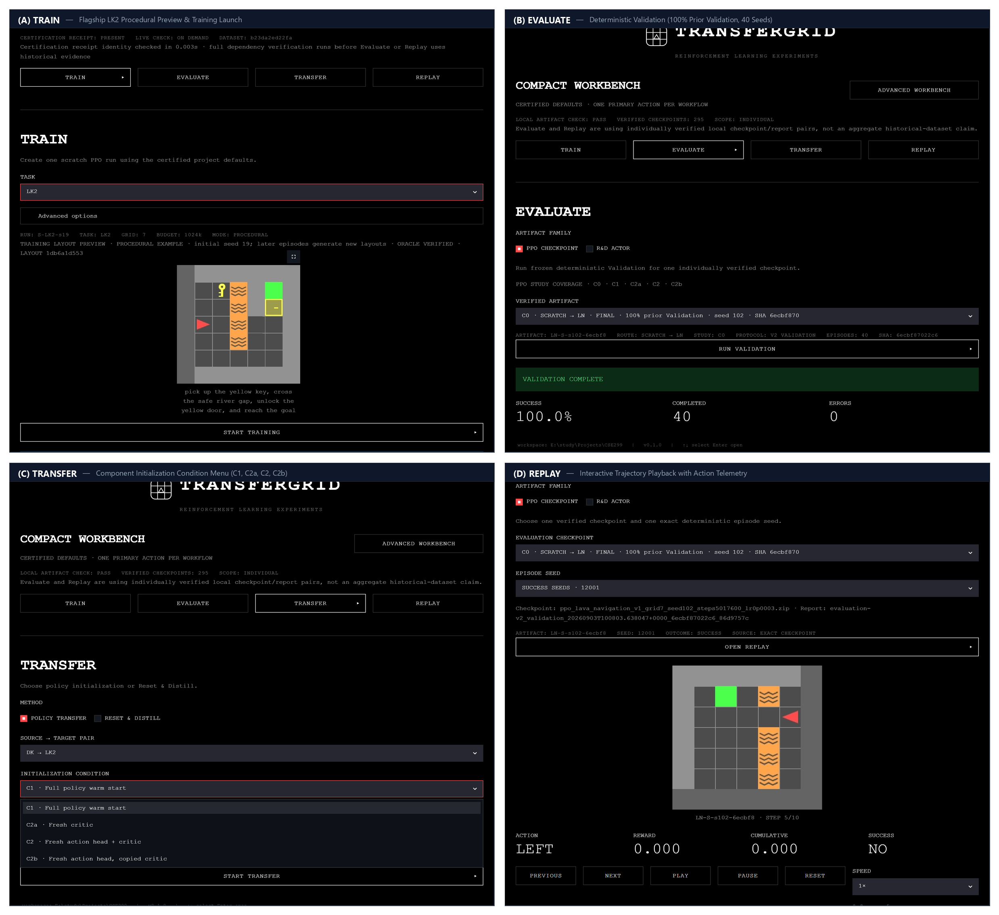
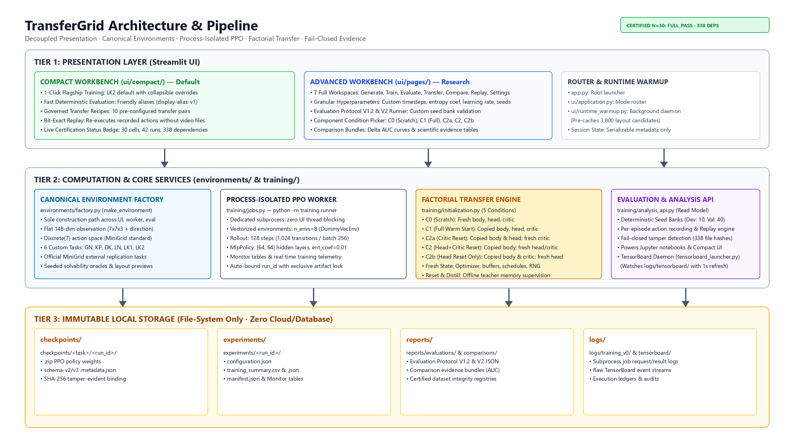

# TransferGrid

TransferGrid is a local Streamlit workbench for training, evaluating, transferring and replaying PPO agents in MiniGrid.



## What it does

- **Train** a PPO policy from scratch on one of the included grid-world tasks.
- **Evaluate** a saved checkpoint with deterministic validation episodes.
- **Transfer** a full policy or selectively reset the action head and critic.
- **Replay** recorded episodes with play, pause, step, reset and speed controls.

Long-running jobs execute outside the Streamlit render loop. Checkpoints carry configuration and provenance metadata, while evaluation reports remain linked to the exact checkpoint they inspect.

## Run locally

Requirements: Python 3.11+ and Windows, Linux or macOS.

```bash
git clone https://github.com/Szaman07/CSE299_TransferGrid.git
cd CSE299_TransferGrid
python -m venv .venv
```

Activate the environment, then install and launch:

```bash
python -m pip install -r requirements.txt
python -m streamlit run app.py
```

The repository starts without bundled experiment data. Train a checkpoint locally to populate the artifact-driven workflows.

## Architecture



| Layer | Responsibility |
|---|---|
| `ui/` | Compact Streamlit workflow and interaction state |
| `environments/` | Task catalog, construction and rendering |
| `training/` | PPO execution, transfer initialization, evaluation and replay |
| `models/`, `metrics/` | Model and measurement utilities |

Generated checkpoints, reports, logs and local experiment data are intentionally ignored so a clone stays lightweight.

## License

[MIT](LICENSE)
